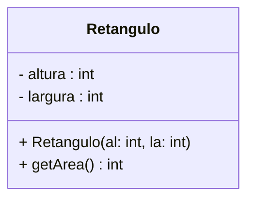
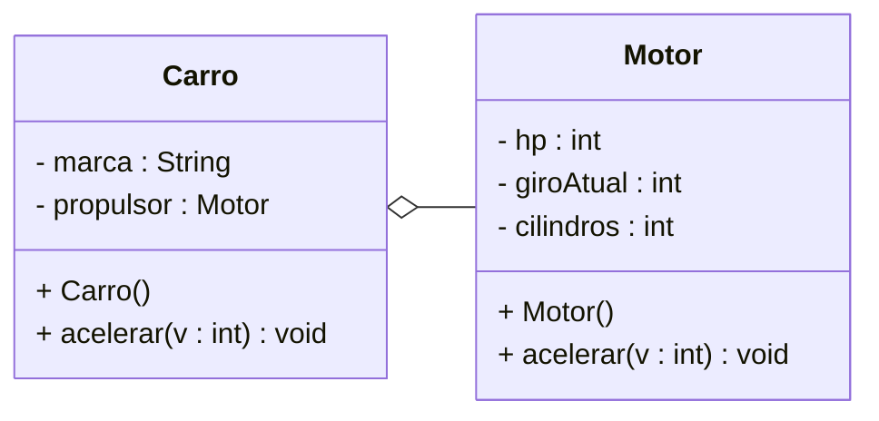
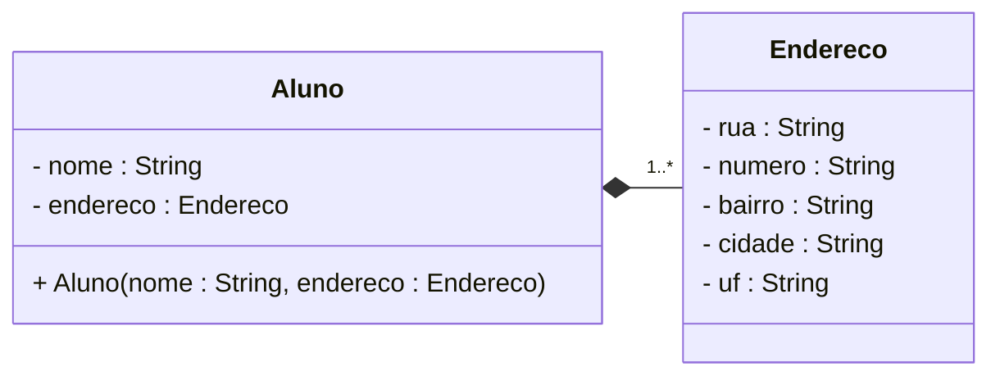

```mermaid
classDiagram
    class Retangulo{
        - altura : int 
        - largura : int
        + Retangulo(al: int, la: int)
        + getArea() int
    }
```

```mermaid
classDiagram
    direction LR
    
    class Carro{
        - marca : String
        - propulsor : Motor
        + Carro()
        + acelerar(v : int) void
    }
    
    class Motor{
        - hp : int
        - giroAtual : int
        - cilindros : int
        + Motor()
        + acelerar(v : int) void
    }
    
    Carro o-- Motor
```

___

```mermaid
classDiagram
    direction LR
    
    class Aluno{
        - nome : String
        - endereco : Endereco
        + Aluno(nome : String, endereco : Endereco)
    }
    
    class Endereco {
        - rua : String
        - numero : String
        - bairro : String
        - cidade : String
        - uf : String
    }
    
    Aluno *--"1..*" Endereco
```