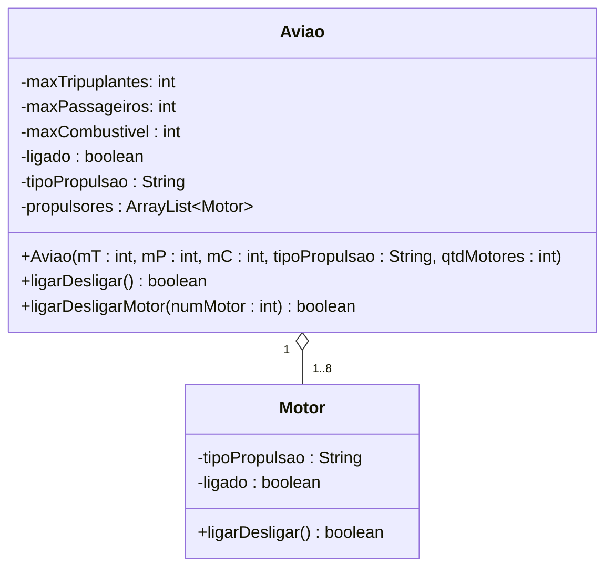

```mermaid
classDiagram
    direction TB
    
    
    class Aviao{
        -maxTripuplantes: int
        -maxPassageiros: int
        -maxCombustivel : int
        -ligado : boolean
        -tipoPropulsao : String
        -propulsores : ArrayList~Motor~
        
        +Aviao(mT : int, mP : int, mC : int, tipoPropulsao : String, qtdMotores : int)
        +ligarDesligar() boolean
        +ligarDesligarMotor(numMotor : int) boolean
    }
    
    class Motor{
        -tipoPropulsao : String
        -ligado : boolean
        
        +ligarDesligar() boolean
    }
    
    Aviao "1"o--"1..8" Motor
```