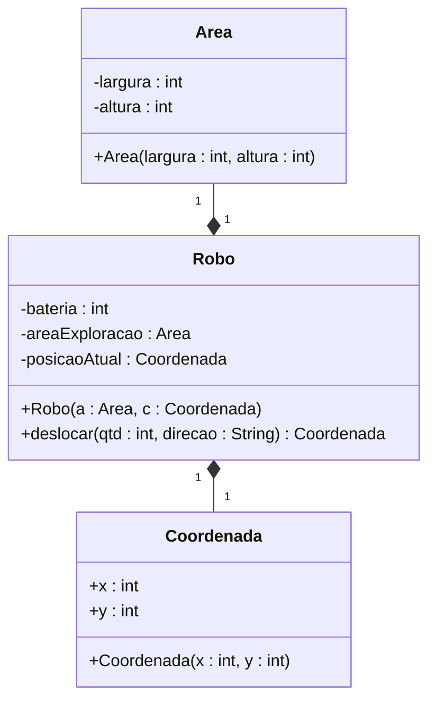

```mermaid
classDiagram
    direction TB
    
    class Area{
        -largura : int
        -altura : int
        +Area(largura : int, altura : int)
    }
    
    class Robo{
        -bateria : int
        -areaExploracao : Area
        -posicaoAtual : Coordenada
        +Robo(a : Area, c : Coordenada)
        +deslocar(qtd : int, direcao : String) Coordenada
    }
    
    class Coordenada{
        +x : int
        +y : int
        +Coordenada(x : int, y : int)
    }
    
    Area "1" --* "1" Robo
    Robo "1" *-- "1" Coordenada
```