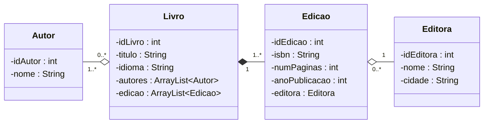
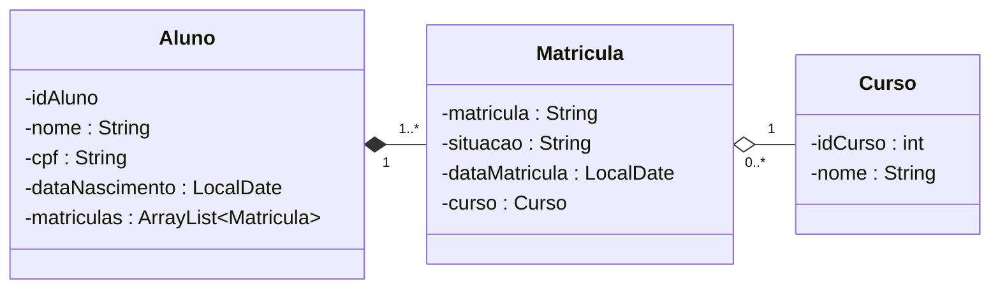

# Modelando entidades e relacionamentos

- Modelando sistema de gerência de livros:

```mermaid
    classDiagram
        direction LR
        
        class Autor{
            -idAutor : int
            -nome : String
        }
        
        
        class Livro{
            -idLivro : int
            -titulo : String
            -idioma : String
            -autores : ArrayList~Autor~
            -edicao : ArrayList~Edicao~
        }
        class Editora{
            -idEditora : int
            -nome : String
            -cidade : String
        }
        
        class Edicao{
            -idEdicao : int
            -isbn : String
            -numPaginas : int
            -anoPublicacao : int
            -editora : Editora
        }
        
        Autor "1..*" --o "0..*" Livro
        Livro "1" *-- "1..*" Edicao
        Edicao "0..*" o-- "1" Editora
```

- Modelando sistema acadêmico:

```mermaid
    classDiagram
        direction LR
        
        class Aluno{
            -idAluno
            -nome : String
            -cpf : String
            -dataNascimento : LocalDate
            -matriculas : ArrayList~Matricula~
        }
        
        class Matricula{
            -matricula : String
            -situacao : String
            -dataMatricula : LocalDate
            -curso : Curso
        }
        
        class Curso{
            -idCurso : int
            -nome : String
        }
        
        Aluno "1" *-- "1..*" Matricula
        Matricula "0..*" o-- "1" Curso
        
```