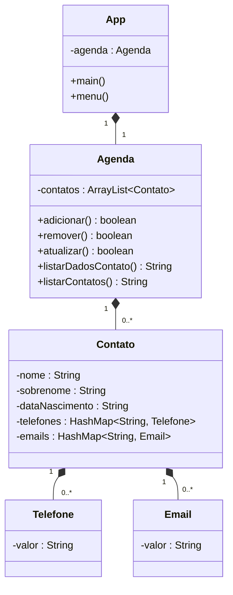

# Sistema para gestão de Agenda telefônica

## Requisitos e regra de negócio:

- O sistema deve permitir ao usuário gerenciar uma agenda telefônica, onde é possível armazenar informações de contatos pessoais e profissionais
    - Adicionar, Remover, Atualizar, Listar dados de um contato, Listar todos contatos
- Todo contato deve possuir: 
  - Nome, Sobrenome, Data de nascimento, Telefone(s) e email(s)
- Todo telefone ou email deve possuir um rótulo de identificação (p. ex. celular, comercial, pessoal) e um valor (p. ex. pessoal: juca@example.com)
  - Não deve ser permitido adicionar um email que não seja válido
  - Os telefones devem ser exibidos formatados, no formato internacional: Ex: 
  +55048998761234 → +55 (48) 9 9876-1234
- Ao listar os contatos, deve-se exibir o nome completo, data de nascimento, telefone(s) e email(s) de cada contato
- Os telefones e emails devem ser exibidos com o rótulo de identificação

## UML:
