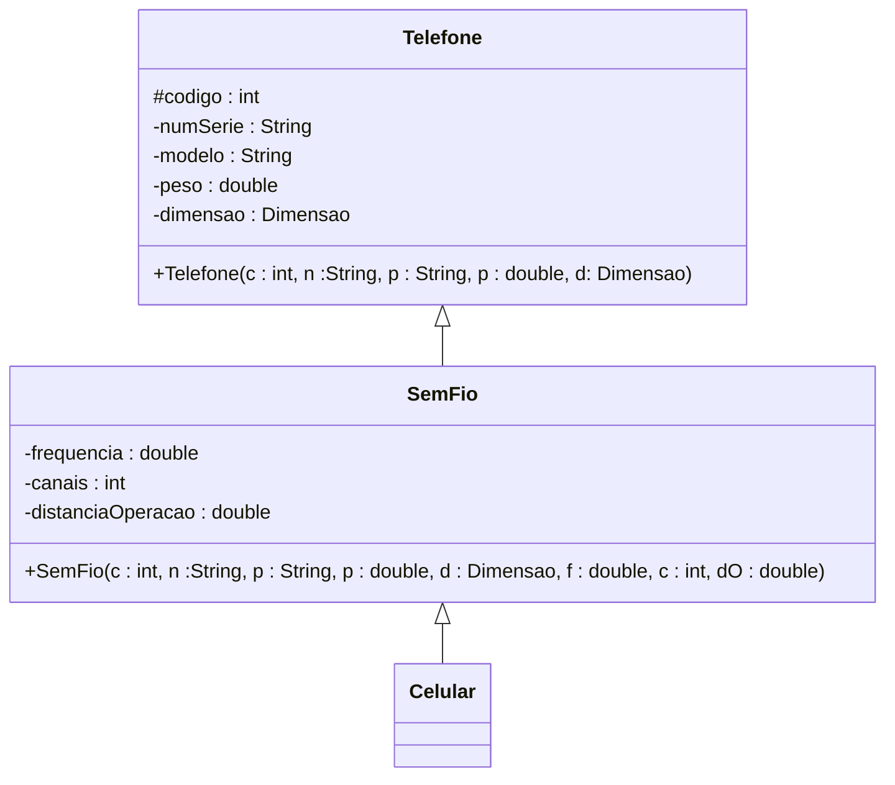

# Exemplo 1:

```mermaid
    classDiagram
        
    class Telefone {
        #codigo : int
        -numSerie : String
        -modelo : String
        -peso : double
        -dimensao : Dimensao
        +Telefone(c : int, n :String, p : String, p : double, d: Dimensao)
    }

    class SemFio {
        -frequencia : double
        -canais : int
        -distanciaOperacao : double
        +SemFio(c : int, n :String, p : String, p : double, d : Dimensao, f : double, c : int, dO : double)
    }
    
    class Celular

    Telefone <|-- SemFio
    SemFio <|-- Celular 
```