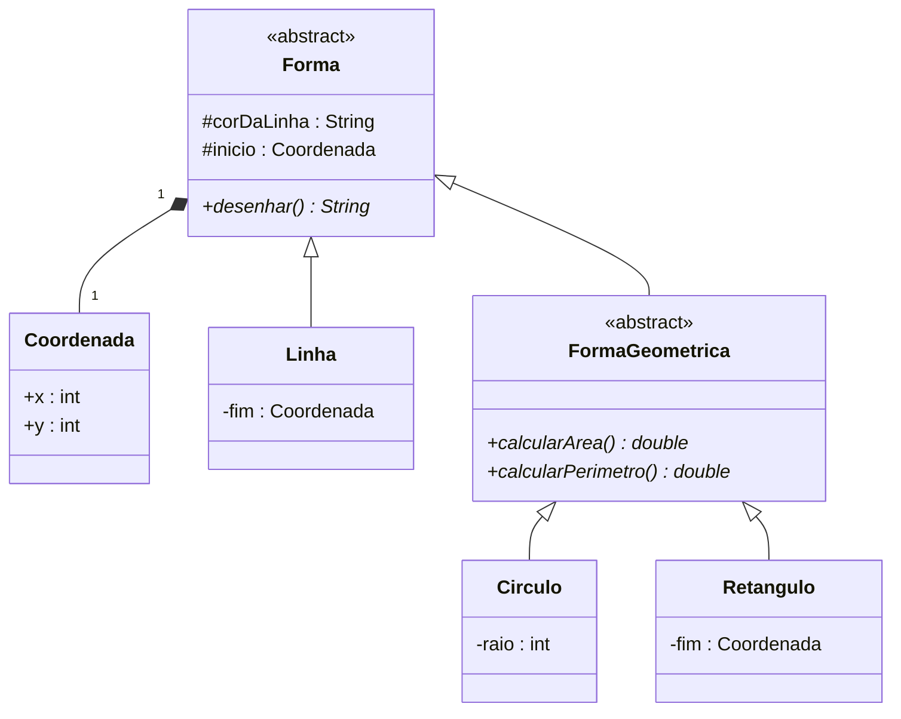

```mermaid
classDiagram
    class Coordenada{
        +x : int
        +y : int
    }
    
    class Forma{
        <<abstract>>
        #corDaLinha : String
        #inicio : Coordenada
        +desenhar()  String *
    }
    
    class Linha{
        -fim : Coordenada
    }
    
    class FormaGeometrica{
        <<abstract>>
        +calcularArea() double *
        +calcularPerimetro() double *
    }
    
    class Circulo{
        -raio : int
    }
    
    class Retangulo{
        -fim : Coordenada
    }

    Forma "1" *-- "1" Coordenada
    Forma <|-- Linha
    Forma <|-- FormaGeometrica
    FormaGeometrica <|-- Circulo
    FormaGeometrica <|-- Retangulo
```