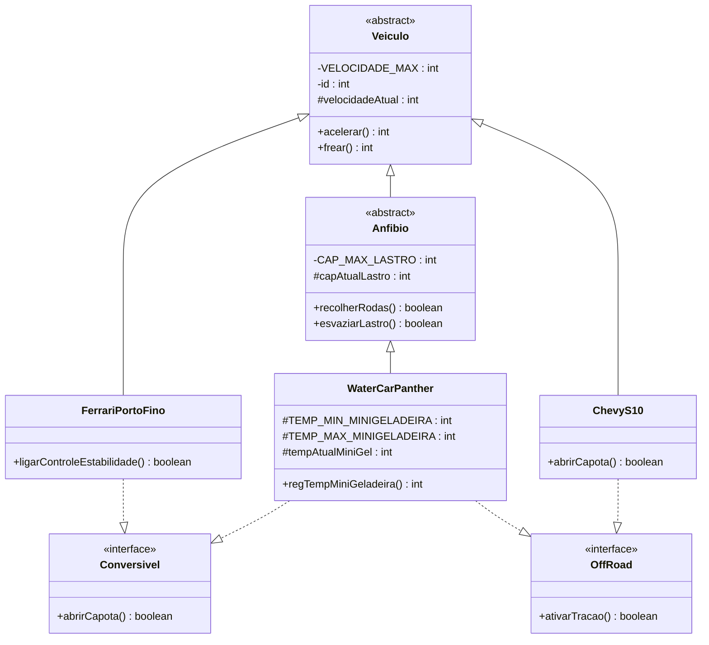

```mermaid
classDiagram
    
    class Veiculo {
        <<abstract>>
        -VELOCIDADE_MAX : int
        -id : int
        #velocidadeAtual : int
        +acelerar() int
        +frear() int
    }

    class Anfibio{
        <<abstract>>
        -CAP_MAX_LASTRO : int
        #capAtualLastro : int
        +recolherRodas() boolean
        +esvaziarLastro() boolean
    }
    class Conversivel{
        <<interface>>
        +abrirCapota() boolean
    }
    class OffRoad{
        <<interface>>
        +ativarTracao() boolean
    }
    
    class FerrariPortoFino{
        +ligarControleEstabilidade() boolean
    }
    class ChevyS10{
        +abrirCapota() boolean
    }
    class WaterCarPanther{
        #TEMP_MIN_MINIGELADEIRA : int
        #TEMP_MAX_MINIGELADEIRA : int
        #tempAtualMiniGel : int
        +regTempMiniGeladeira() int
    }
    
    Veiculo <|-- Anfibio
    Veiculo <|-- FerrariPortoFino
    Veiculo <|-- ChevyS10

    Anfibio <|-- WaterCarPanther
    
    FerrariPortoFino ..|> Conversivel
    WaterCarPanther ..|> Conversivel
    WaterCarPanther ..|> OffRoad 
    ChevyS10 ..|> OffRoad
```