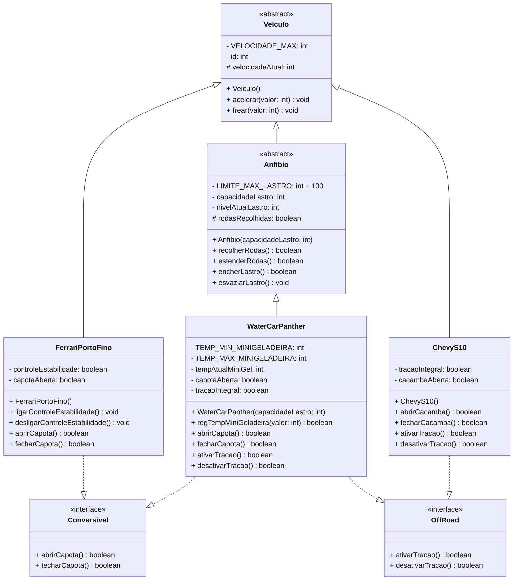

```mermaid
classDiagram
    class Veiculo {
        <<abstract>>
        - VELOCIDADE_MAX: int
        - id: int
        # velocidadeAtual: int
        + Veiculo()
        + acelerar(valor: int) void
        + frear(valor: int) void
    }

    class Anfibio {
        <<abstract>>
        - LIMITE_MAX_LASTRO: int = 100
        - capacidadeLastro: int
        - nivelAtualLastro: int
        # rodasRecolhidas: boolean
        + Anfibio(capacidadeLastro: int)
        + recolherRodas() boolean
        + estenderRodas() boolean
        + encherLastro() boolean
        + esvaziarLastro() void
    }
    class Conversivel {
        <<interface>>
        + abrirCapota() boolean
        + fecharCapota() boolean
    }
    class OffRoad {
        <<interface>>
        + ativarTracao() boolean
        + desativarTracao() boolean
    }

    class FerrariPortoFino {
        - controleEstabilidade: boolean
        - capotaAberta: boolean
        + FerrariPortoFino()
        + ligarControleEstabilidade() void
        + desligarControleEstabilidade() void
        + abrirCapota() boolean
        + fecharCapota() boolean
    }
    class ChevyS10 {
        - tracaoIntegral: boolean
        - cacambaAberta: boolean
        + ChevyS10()
        + abrirCacamba() boolean
        + fecharCacamba() boolean
        + ativarTracao() boolean
        + desativarTracao() boolean
    }
    class WaterCarPanther {
        - TEMP_MIN_MINIGELADEIRA: int
        - TEMP_MAX_MINIGELADEIRA: int
        - tempAtualMiniGel: int
        - capotaAberta: boolean
        - tracaoIntegral: boolean
        + WaterCarPanther(capacidadeLastro: int)
        + regTempMiniGeladeira(valor: int) boolean
        + abrirCapota() boolean
        + fecharCapota() boolean
        + ativarTracao() boolean
        + desativarTracao() boolean
    }

    Veiculo <|-- Anfibio
    Veiculo <|-- FerrariPortoFino
    Veiculo <|-- ChevyS10
    Anfibio <|-- WaterCarPanther
    FerrariPortoFino ..|> Conversivel
    WaterCarPanther ..|> Conversivel
    WaterCarPanther ..|> OffRoad
    ChevyS10 ..|> OffRoad
```